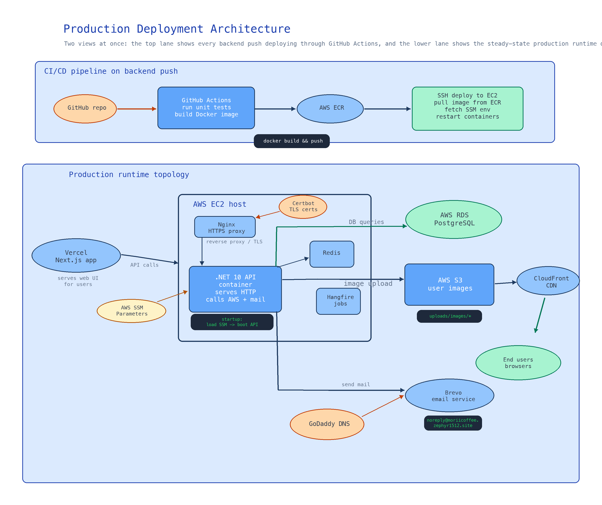
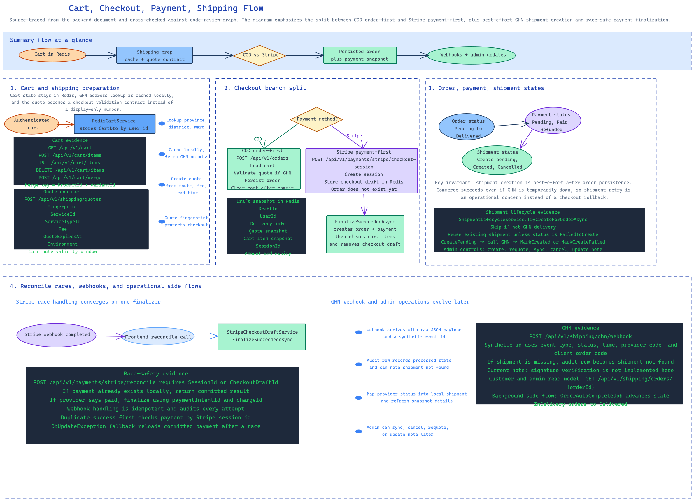

# Morii Coffee API

Backend API for Morii Coffee, built on .NET 10 with Clean Architecture, CQRS, EF Core, PostgreSQL, Redis, Stripe, Hangfire, and a GHN shipping integration.

## Overview

- `source/MoriiCoffee.Presentation` hosts the ASP.NET Core API, middleware, Swagger, health checks, and Hangfire dashboard.
- `source/MoriiCoffee.Application` contains MediatR commands/queries, validators, DTOs, and application services.
- `source/MoriiCoffee.Domain` and `source/MoriiCoffee.Domain.Shared` hold aggregates, enums, and business rules.
- `source/MoriiCoffee.Infrastructure` and `source/MoriiCoffee.Infrastructure.Persistence` implement external integrations, repositories, caching, background jobs, and migrations.

## Core Capabilities

- Authentication with JWT and Google OAuth.
- Catalog, category, banner, store, wishlist, and blog management.
- Redis-backed cart for authenticated users.
- Order lifecycle management for pickup and GHN delivery.
- Stripe payment-first checkout, reconciliation, refunds, and audited webhooks.
- GHN shipping quote, shipment creation, requote, sync, cancel, and webhook ingestion.
- File upload/download through MinIO and AWS S3-backed services.
- Admin reports and scheduled order auto-completion through Hangfire.

## Architecture

```text
Presentation
  -> controllers, HTTP pipeline, middleware, Swagger, Hangfire dashboard
Infrastructure / Infrastructure.Persistence
  -> payment, shipping, storage, email, Redis, EF Core, repositories, migrations
Application
  -> commands, queries, validators, DTOs, orchestration services
Domain / Domain.Shared
  -> aggregates, entities, enums, settings contracts, invariants
```

The codebase follows a standard inward dependency direction: outer layers depend on inner layers, not the reverse.

## Local Development

### Prerequisites

- .NET 10 SDK
- Docker Desktop

### Start the local stack

```bash
cd deploy
bash run-docker-development.sh
```

This starts:

- API at `http://localhost:8002`
- Swagger at `http://localhost:8002/swagger`
- Hangfire dashboard at `http://localhost:8002/hangfire`
- PostgreSQL at `localhost:5432`
- Redis at `localhost:6379`
- MinIO console at `http://localhost:9001`

The local compose files are:

- [`deploy/docker-compose.yml`](/Users/zephyr.nguyen/dev-space/projects/morii/morii-coffee/deploy/docker-compose.yml:1): PostgreSQL, Redis, MinIO
- [`deploy/docker-compose.development.yml`](/Users/zephyr.nguyen/dev-space/projects/morii/morii-coffee/deploy/docker-compose.development.yml:1): API container overlay
- [`deploy/run-docker-development.sh`](/Users/zephyr.nguyen/dev-space/projects/morii/morii-coffee/deploy/run-docker-development.sh:1): convenience wrapper

### Configuration model

The runtime configuration pipeline is defined in [`HostExtensions.cs`](/Users/zephyr.nguyen/dev-space/projects/morii/morii-coffee/source/MoriiCoffee.Presentation/Extensions/HostExtensions.cs:5):

- base `appsettings.json`
- environment override `appsettings.{Environment}.json`
- environment variables
- user secrets in `Development`

Operationally, prefer environment variables and user secrets for sensitive values. `README` intentionally does not duplicate the `appsettings.json` shape.

## Runtime Startup Behavior

At startup the API:

1. registers infrastructure services and Serilog in [`Program.cs`](/Users/zephyr.nguyen/dev-space/projects/morii/morii-coffee/source/MoriiCoffee.Presentation/Program.cs:8)
2. enables Swagger, forwarded headers, CORS, auth, controllers, `/health`, and Hangfire dashboard in [`ApplicationExtensions.cs`](/Users/zephyr.nguyen/dev-space/projects/morii/morii-coffee/source/MoriiCoffee.Presentation/Extensions/ApplicationExtensions.cs:13)
3. auto-applies pending EF Core migrations and runs `ApplicationDbContextSeed.SeedAsync()` on boot in [`ApplicationExtensions.cs`](/Users/zephyr.nguyen/dev-space/projects/morii/morii-coffee/source/MoriiCoffee.Presentation/Extensions/ApplicationExtensions.cs:60)
4. registers the recurring `order-auto-complete` Hangfire job in [`HangfireJobsExtensions.cs`](/Users/zephyr.nguyen/dev-space/projects/morii/morii-coffee/source/MoriiCoffee.Presentation/Extensions/HangfireJobsExtensions.cs:13)

## Production Deploy Flow

The repository contains one production pipeline in [`deploy.yml`](/Users/zephyr.nguyen/dev-space/projects/morii/morii-coffee/.github/workflows/deploy.yml:1):

Deployment diagram:

- [production-deployment-architecture.excalidraw](/Users/zephyr.nguyen/dev-space/projects/morii/morii-coffee/diagrams/production-deployment-architecture.excalidraw:1)



1. push to `main`
2. run `dotnet test` for `MoriiCoffee.Application.Tests` and `MoriiCoffee.Domain.Tests`
3. build the `final` target from [`source/MoriiCoffee.Presentation/Dockerfile`](/Users/zephyr.nguyen/dev-space/projects/morii/morii-coffee/source/MoriiCoffee.Presentation/Dockerfile:26)
4. push the image to AWS ECR
5. SSH into EC2
6. run `bash /app/fetch-ssm-env.sh`
7. run `bash /app/run-container.sh <image>`
8. prune old images

Operational implications of the current production path:

- The repo documents a remote fetch from AWS SSM, but the scripts invoked on EC2 are not stored in this repository.
- The application itself also supports checked-in environment JSON files plus environment variables; the deploy pipeline does not remove that behavior.
- Database migrations and seeding happen inside application startup, not in a separate release step.
- The Hangfire dashboard is mounted by default; this repo does not add a dashboard authorization filter.
- `/health` is available as a simple runtime health endpoint.

## Business Flows

Cart, order checkout, payment, and shipping flow:

- [cart-order-checkout-payment-shipping-flow.excalidraw](/Users/zephyr.nguyen/dev-space/projects/morii/morii-coffee/diagrams/cart-order-checkout-payment-shipping-flow.excalidraw:1)



### Cart

The cart is implemented by [`RedisCartService.cs`](/Users/zephyr.nguyen/dev-space/projects/morii/morii-coffee/source/MoriiCoffee.Infrastructure/Services/Cart/RedisCartService.cs:12).

- Storage key: `cart:{userId}`
- Value: serialized `CartDto`
- TTL: `CacheTtlConstants.Cart`
- Duplicate product/variant pairs are merged by incrementing quantity.
- Guest cart merge is handled through `POST /api/v1/cart/merge`.

Controller surface:

- `GET /api/v1/cart`
- `POST /api/v1/cart/items`
- `PUT /api/v1/cart/items`
- `DELETE /api/v1/cart/items`
- `DELETE /api/v1/cart`
- `POST /api/v1/cart/merge`

### Orders

Order entry points live in [`OrdersController.cs`](/Users/zephyr.nguyen/dev-space/projects/morii/morii-coffee/source/MoriiCoffee.Presentation/Controllers/OrdersController.cs:22).

- `POST /api/v1/orders` is for immediate order creation flows such as COD.
- Stripe orders are not created here; they are finalized only after payment confirmation.
- GHN delivery orders require a shipping quote fingerprint, service selection, fee, expiry, and provider environment.
- Admins can fetch all orders, update status, and inspect valid next statuses.

`PlaceOrderCommandHandler` in [`PlaceOrderCommandHandler.cs`](/Users/zephyr.nguyen/dev-space/projects/morii/morii-coffee/source/MoriiCoffee.Application/Commands/Order/PlaceOrder/PlaceOrderCommandHandler.cs:25) does the main orchestration:

1. load cart from Redis
2. create an order snapshot from cart items
3. validate the GHN quote fingerprint for delivery orders
4. persist the order and optionally upsert the saved delivery profile
5. attempt shipment creation for GHN orders
6. clear the cart

### Payments

Payment HTTP endpoints live in [`PaymentsController.cs`](/Users/zephyr.nguyen/dev-space/projects/morii/morii-coffee/source/MoriiCoffee.Presentation/Controllers/PaymentsController.cs:19) and [`PaymentWebhookController.cs`](/Users/zephyr.nguyen/dev-space/projects/morii/morii-coffee/source/MoriiCoffee.Presentation/Controllers/PaymentWebhookController.cs:11).

Implemented flow:

1. `POST /api/v1/payments/stripe/checkout-session` snapshots the current cart and checkout data into a cached draft.
2. Stripe-hosted checkout completes payment.
3. `POST /api/v1/payments/stripe/webhook` verifies the Stripe signature and finalizes or reconciles state.
4. `POST /api/v1/payments/stripe/reconcile` lets the frontend self-heal when the success redirect arrives before webhook processing.

Relevant implementation points:

- Draft caching and order finalization: [`StripeCheckoutDraftService.cs`](/Users/zephyr.nguyen/dev-space/projects/morii/morii-coffee/source/MoriiCoffee.Application/Services/StripeCheckoutDraftService.cs:19)
- Stripe gateway implementation: [`StripePaymentGateway.cs`](/Users/zephyr.nguyen/dev-space/projects/morii/morii-coffee/source/MoriiCoffee.Infrastructure/Services/Payment/StripePaymentGateway.cs:27)
- Webhook auditing and idempotency: [`HandleWebhookEventCommandHandler.cs`](/Users/zephyr.nguyen/dev-space/projects/morii/morii-coffee/source/MoriiCoffee.Application/Commands/Payment/HandleWebhookEvent/HandleWebhookEventCommandHandler.cs:28)

### Shipping

Shipping endpoints live in [`ShippingController.cs`](/Users/zephyr.nguyen/dev-space/projects/morii/morii-coffee/source/MoriiCoffee.Presentation/Controllers/ShippingController.cs:24) and [`ShippingWebhookController.cs`](/Users/zephyr.nguyen/dev-space/projects/morii/morii-coffee/source/MoriiCoffee.Presentation/Controllers/ShippingWebhookController.cs:9).

Implemented GHN flow:

1. fetch provinces, districts, and wards
2. quote shipping from the current cart
3. place a COD order or finalize a Stripe-paid order
4. create a GHN shipment using the stored order snapshot
5. sync, requote, cancel, or update shipment note through admin endpoints
6. accept GHN webhook updates and persist shipment audit rows

Core orchestration lives in:

- quote creation: [`CreateShippingQuoteCommandHandler.cs`](/Users/zephyr.nguyen/dev-space/projects/morii/morii-coffee/source/MoriiCoffee.Application/Commands/Shipping/CreateShippingQuote/CreateShippingQuoteCommandHandler.cs:11)
- shipment lifecycle: [`ShipmentLifecycleService.cs`](/Users/zephyr.nguyen/dev-space/projects/morii/morii-coffee/source/MoriiCoffee.Application/Services/Shipping/ShipmentLifecycleService.cs:14)
- webhook processing: [`HandleShippingWebhookEventCommandHandler.cs`](/Users/zephyr.nguyen/dev-space/projects/morii/morii-coffee/source/MoriiCoffee.Application/Commands/Shipping/HandleShippingWebhookEvent/HandleShippingWebhookEventCommandHandler.cs:11)

## Background Jobs And Operations

Hangfire is configured in [`HangfireConfiguration.cs`](/Users/zephyr.nguyen/dev-space/projects/morii/morii-coffee/source/MoriiCoffee.Infrastructure/Configurations/HangfireConfiguration.cs:12) with PostgreSQL storage.

The recurring job currently registered is:

- `order-auto-complete`: runs daily at `0 {AutoCompleteJobRunHour} * * *` and executes [`OrderAutoCompleteJob.cs`](/Users/zephyr.nguyen/dev-space/projects/morii/morii-coffee/source/MoriiCoffee.Infrastructure/BackgroundJobs/OrderAutoCompleteJob.cs:1)

## API Surface

Main route groups:

- `/api/v1/auth`
- `/api/v1/products`
- `/api/v1/categories`
- `/api/v1/banners`
- `/api/v1/stores`
- `/api/v1/cart`
- `/api/v1/orders`
- `/api/v1/payments`
- `/api/v1/shipping`
- `/api/v1/users`
- `/api/v1/files`
- `/api/v1/admin-reports`

Swagger is available in development at `/swagger`.

## Testing

Run the main backend test suites with:

```bash
dotnet test source/MoriiCoffee.Domain.Tests --configuration Release
dotnet test source/MoriiCoffee.Application.Tests --configuration Release
```

Coverage helper:

```bash
bash coverage.sh
```

## Project Structure

```text
morii-coffee/
├── .github/workflows/
├── deploy/
├── specs/
├── source/
│   ├── MoriiCoffee.Application/
│   ├── MoriiCoffee.Application.Tests/
│   ├── MoriiCoffee.DbMigrator/
│   ├── MoriiCoffee.Domain/
│   ├── MoriiCoffee.Domain.Shared/
│   ├── MoriiCoffee.Domain.Tests/
│   ├── MoriiCoffee.Infrastructure/
│   ├── MoriiCoffee.Infrastructure.Persistence/
│   └── MoriiCoffee.Presentation/
├── coverage.sh
├── Directory.Build.props
├── global.json
└── MoriiCoffee.slnx
```
