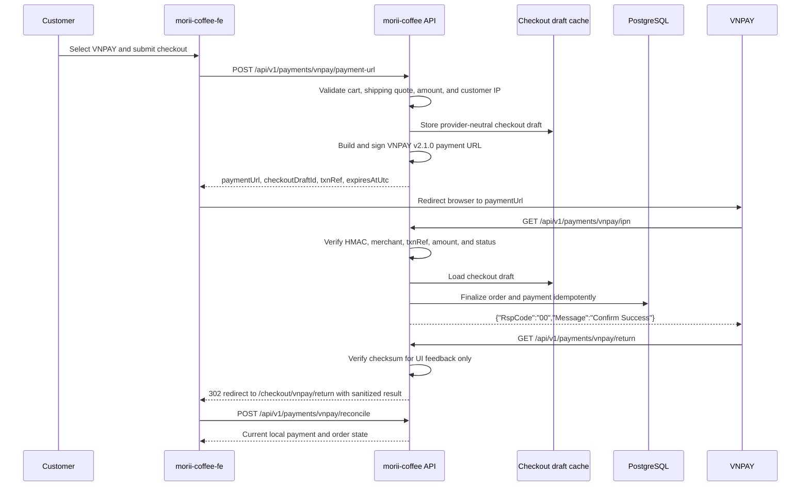

# Integrating VNPAY into Morii Coffee

This guide describes how to add VNPAY PAY payments to Morii Coffee while preserving the existing payment-first checkout architecture. It covers the .NET backend in `morii-coffee`, the Next.js frontend in `morii-coffee-fe`, sandbox setup, security, testing, refunds, reconciliation, and production rollout.

The recommended design keeps all VNPAY signing and transaction processing in the backend. The frontend only selects VNPAY, requests a payment URL, redirects the browser, and displays the final state returned by the backend.

> Documentation review date: June 15, 2026.

## Implementation status

The backend implementation is available with sandbox-first configuration, provider-owned payment persistence, signed payment URLs, authoritative/idempotent IPN processing, read-only return redirects, QueryDR reconciliation, and capability-gated refunds. See [FRONTEND_HANDOFF.md](./FRONTEND_HANDOFF.md) for the frontend contract.

Production deployment must configure `Vnpay__TmnCode`, `Vnpay__HashSecret`, `Vnpay__ReturnUrl`, and `Vnpay__StorefrontReturnUrl` through secrets/environment variables. Keep ASP.NET forwarded-header trust restricted to known reverse proxies so a client cannot forge the IP sent to VNPAY.

Live sandbox acceptance still requires merchant credentials, a public HTTPS callback, and VNPAY-side IPN/refund enablement.

## Important decision: do not install the JavaScript VNPAY library

The documentation at [vnpay.js.org](https://vnpay.js.org/en/) describes an open-source Node.js library. Its architecture and workflow are useful references, but the library itself is not suitable for Morii Coffee:

- `morii-coffee` is a .NET backend, not a Node.js backend.
- `morii-coffee-fe` is a browser-facing Next.js application. VNPAY secrets and HMAC signing must never be placed in frontend code.
- The VNPAY library documentation explicitly states that the package uses Node.js modules and must run on the server.

Implement the VNPAY v2.1.0 protocol in the .NET infrastructure layer with `HttpClient`, `HMACSHA512`, and provider-specific request and response models.

## Target outcome

After implementation, a customer can:

1. Select VNPAY during checkout.
2. Submit delivery information and receive a signed VNPAY payment URL.
3. Complete or cancel payment on the VNPAY hosted page.
4. Return to Morii Coffee and see a pending, paid, failed, or expired state.
5. See the finalized order after the authoritative VNPAY IPN is processed.

An administrator can:

1. View VNPAY payment attempts and provider transaction identifiers.
2. Query VNPAY to reconcile a missing or delayed IPN.
3. Request a full or partial refund when VNPAY enables the refund API for the merchant.
4. Reconcile refund status.

## Recommended payment flow



The IPN endpoint is the authoritative transaction update path. The return endpoint verifies the response and redirects the browser, but it must not mark an order as paid. A customer can close the browser before the return redirect, and return URL parameters can be replayed.

## Existing Morii Coffee architecture to reuse

The backend already contains the main building blocks:

- `PaymentsController` exposes authenticated checkout, reconciliation, history, and refund operations.
- `PaymentWebhookController` verifies Stripe webhooks and dispatches normalized payment events.
- `IPaymentGateway` keeps provider SDK details outside the Application and Domain layers.
- `StripeCheckoutDraftService` stores a payment-first checkout draft before an order exists.
- `Payment`, `PaymentWebhookEvent`, and `RefundRecord` persist attempt, notification, and refund history.
- `HandleWebhookEventCommandHandler` performs idempotent finalization.
- `GetPaymentByOrderIdQuery` exposes payment history to customer and admin screens.

The frontend already contains:

- A payment method selector in `src/components/checkout/payment-method-selector.tsx`.
- Payment-first redirect behavior in `src/app/checkout/page.tsx`.
- Payment API calls in `src/services/payment-service.ts`.
- Return-state polling in `src/components/checkout/stripe-return-state.tsx`.
- Payment status helpers in `src/lib/payment.ts`.
- Customer and admin payment history displays.

VNPAY should extend these capabilities instead of creating an unrelated payment subsystem.

## Phase 1: Prepare VNPAY sandbox and configuration

### Create and configure a sandbox merchant

1. Register or obtain a VNPAY sandbox merchant account.
2. Record the terminal code (`vnp_TmnCode`) and hash secret.
3. Configure the sandbox IPN URL in the VNPAY merchant portal.
4. Expose the local backend through a public HTTPS tunnel during development.
5. Set the configured IPN URL to:

```text
https://{public-api-host}/api/v1/payments/vnpay/ipn
```

VNPAY requires the IPN URL to use SSL. Production IPN configuration must be coordinated with VNPAY support.

### Add backend configuration

Add a strongly typed `VnpaySettings` class in:

```text
source/MoriiCoffee.Domain.Shared/Settings/VnpaySettings.cs
```

Recommended shape:

```csharp
public sealed class VnpaySettings
{
    public string TmnCode { get; init; } = string.Empty;
    public string HashSecret { get; init; } = string.Empty;
    public string PaymentUrl { get; init; } =
        "https://sandbox.vnpayment.vn/paymentv2/vpcpay.html";
    public string ApiUrl { get; init; } =
        "https://sandbox.vnpayment.vn/merchant_webapi/api/transaction";
    public string ReturnUrl { get; init; } = string.Empty;
    public string Currency { get; init; } = "VND";
    public string Locale { get; init; } = "vn";
    public string Version { get; init; } = "2.1.0";
    public string OrderType { get; init; } = "other";
    public int PaymentExpiryMinutes { get; init; } = 15;
}
```

Add a `Vnpay` section to appsettings files with empty secret placeholders. Supply real values through environment variables:

```bash
Vnpay__TmnCode=...
Vnpay__HashSecret=...
Vnpay__PaymentUrl=https://sandbox.vnpayment.vn/paymentv2/vpcpay.html
Vnpay__ApiUrl=https://sandbox.vnpayment.vn/merchant_webapi/api/transaction
Vnpay__ReturnUrl=https://api.example.com/api/v1/payments/vnpay/return
Vnpay__Locale=vn
Vnpay__PaymentExpiryMinutes=15
```

Never expose `Vnpay__HashSecret` to the frontend or commit it to source control.

Add:

```text
source/MoriiCoffee.Infrastructure/Configurations/VnpayConfiguration.cs
source/MoriiCoffee.Infrastructure/Services/Payment/VnpayStartupDiagnosticsService.cs
```

Register settings, startup validation, and the VNPAY HTTP client from `MoriiCoffee.Infrastructure.DependencyInjection`.

## Phase 2: Make the payment model provider-neutral

The current payment model and DTOs contain Stripe-specific property names. Adding VNPAY directly into those fields would work temporarily, but it would make payment history, refunds, and future providers difficult to reason about.

Perform a provider-neutral migration before implementing VNPAY.

### Add provider enums

Add `VNPAY` to `EPaymentMethod` and frontend `PaymentMethod`.

Add a separate backend provider enum:

```csharp
public enum EPaymentProvider
{
    Stripe = 1,
    Vnpay = 2
}
```

Payment method describes the customer's checkout choice. Payment provider describes which external integration owns an attempt.

### Generalize `Payment`

Recommended field mapping:

| Current field | Provider-neutral field | VNPAY value |
| --- | --- | --- |
| `StripeSessionId` | `ProviderSessionId` | `vnp_TxnRef` |
| `StripePaymentIntentId` | `ProviderPaymentId` | `vnp_TransactionNo` |
| `StripeChargeId` | `ProviderTransactionId` | `vnp_BankTranNo` or `vnp_TransactionNo` |
| None | `Provider` | `Vnpay` |
| None | `ProviderResponseCode` | `vnp_ResponseCode` |
| None | `ProviderTransactionStatus` | `vnp_TransactionStatus` |
| None | `ProviderPayDate` | parsed `vnp_PayDate` |
| None | `ProviderBankCode` | `vnp_BankCode` |
| None | `ProviderCardType` | `vnp_CardType` |

Keep indexes on `(Provider, ProviderSessionId)` and `(Provider, ProviderPaymentId)`. The session key must be unique per provider.

Apply the same provider-neutral naming to:

- `Order.StripePaymentIntentId` and `Order.StripeChargeId`.
- `RefundRecord.StripeRefundId`.
- Payment, order, and refund DTOs returned to the frontend.
- Payment status mappers and admin refund responses.

Generalize repository methods:

```csharp
Task<Payment?> GetByProviderSessionIdAsync(
    EPaymentProvider provider,
    string providerSessionId);

Task<Payment?> GetByProviderPaymentIdAsync(
    EPaymentProvider provider,
    string providerPaymentId);
```

### Generalize checkout drafts

Rename the Stripe-specific draft abstraction:

```text
IStripeCheckoutDraftService       -> ICheckoutDraftService
StripeCheckoutDraftService        -> CheckoutDraftService
StripeCheckoutDraftCacheDto       -> CheckoutDraftCacheDto
```

Add:

```csharp
public EPaymentProvider Provider { get; init; }
public string ProviderSessionId { get; set; } = string.Empty;
public EPaymentStatus PaymentStatus { get; set; }
```

For VNPAY, `ProviderSessionId` is the merchant-generated `vnp_TxnRef`.

Update checkout draft finalization so it creates the order with the draft's payment method and provider. The current finalizer hardcodes `EPaymentMethod.STRIPE`, which must not be reused for VNPAY.

### Generalize webhook audit records

Rename:

```text
StripeEventId -> ProviderEventId
```

Add `Provider` and create a unique index on `(Provider, ProviderEventId)`.

VNPAY IPN does not provide a Stripe-style event id. Derive a deterministic idempotency key:

```text
VNPAY:{vnp_TxnRef}:{vnp_TransactionNo}:{vnp_ResponseCode}:{vnp_TransactionStatus}
```

Store a SHA-256 fingerprint of the canonical query string as the audit payload fingerprint.

### Route gateway operations by provider

The current DI registration maps one `IPaymentGateway` directly to `StripePaymentGateway`. Replace this with provider-specific gateways and a resolver:

```csharp
public interface IPaymentGatewayResolver
{
    IPaymentGateway Resolve(EPaymentProvider provider);
}
```

Both `StripePaymentGateway` and `VnpayPaymentGateway` should expose their provider identity. Checkout, reconciliation, query, and refund handlers must resolve the gateway from the payment provider instead of assuming Stripe.

Keep VNPAY query-string verification in `VnpayPaymentGateway`. Do not place HMAC or URL encoding logic in controllers or command handlers.

### Normalize provider events

`WebhookEventEnvelope` is provider-oriented, but `HandleWebhookEventCommandHandler` currently switches on raw Stripe event names. Add an internal event kind:

```csharp
public enum EPaymentProviderEventKind
{
    PaymentSucceeded,
    PaymentFailed,
    PaymentExpired,
    RefundSucceeded
}
```

Each provider adapter should map its callback semantics to this enum. For VNPAY, the verified IPN maps to `PaymentSucceeded` only when both success fields are `00`; other terminal results map to `PaymentFailed`. The application handler should switch on the normalized kind instead of Stripe event names.

## Phase 3: Implement the .NET VNPAY gateway

Create:

```text
source/MoriiCoffee.Infrastructure/Services/Payment/VnpayPaymentGateway.cs
source/MoriiCoffee.Infrastructure/Services/Payment/VnpaySignatureService.cs
source/MoriiCoffee.Infrastructure/Services/Payment/VnpayClock.cs
source/MoriiCoffee.Infrastructure/Services/Payment/Models/Vnpay*.cs
```

The clock abstraction is useful because VNPAY timestamps use GMT+7 and the `yyyyMMddHHmmss` format.

### Build a payment URL

Required payment URL fields:

```text
vnp_Version=2.1.0
vnp_Command=pay
vnp_TmnCode={merchant terminal code}
vnp_Amount={amount in VND multiplied by 100}
vnp_CurrCode=VND
vnp_TxnRef={unique merchant transaction reference}
vnp_OrderInfo={ASCII order description without special characters}
vnp_OrderType=other
vnp_Locale=vn or en
vnp_ReturnUrl={backend return endpoint}
vnp_IpAddr={validated customer IP}
vnp_CreateDate={GMT+7 yyyyMMddHHmmss}
vnp_ExpireDate={GMT+7 yyyyMMddHHmmss}
```

`vnp_TxnRef` must be unique and must not be duplicated within a day. Use the checkout draft GUID without hyphens:

```csharp
var txnRef = draftId.ToString("N");
```

Do not trust an amount supplied by the frontend. Calculate the amount from the authenticated cart and validated shipping quote.

The raw VNPAY protocol expects `vnp_Amount` multiplied by `100`. This differs from Stripe VND handling. Multiply exactly once in the VNPAY gateway:

```csharp
var vnpAmount = checked(totalAmountVnd * 100L);
```

Sort all `vnp_` fields by ordinal key order, URL encode them consistently, join them with `&`, and sign the canonical string:

```csharp
public static string Sign(string hashSecret, string canonicalData)
{
    var key = Encoding.UTF8.GetBytes(hashSecret);
    var data = Encoding.UTF8.GetBytes(canonicalData);
    using var hmac = new HMACSHA512(key);
    return Convert.ToHexString(hmac.ComputeHash(data)).ToLowerInvariant();
}
```

The exact encoding rules must be shared by URL creation, IPN verification, and return verification. Add golden-vector tests using a fixed parameter set and expected hash.

### Capture the customer IP safely

The API may run behind a reverse proxy. Configure ASP.NET Core forwarded headers for known proxies and networks, then read `HttpContext.Connection.RemoteIpAddress`.

Do not accept `vnp_IpAddr` from the request body. Do not trust arbitrary `X-Forwarded-For` values unless the proxy is configured as trusted.

### Add the create-payment-url command

Recommended endpoint:

```http
POST /api/v1/payments/vnpay/payment-url
Authorization: Bearer {access-token}
Content-Type: application/json
```

Reuse the delivery and shipping fields from `CreateCheckoutSessionDto`.

Recommended response:

```json
{
  "data": {
    "paymentUrl": "https://sandbox.vnpayment.vn/paymentv2/vpcpay.html?...",
    "checkoutDraftId": "d5c26720-14e9-4ba8-bd10-cf737bb01a99",
    "txnRef": "d5c2672014e94ba8bd10cf737bb01a99",
    "amount": 125000,
    "currency": "VND",
    "expiresAtUtc": "2026-06-15T10:30:00Z"
  }
}
```

Implementation steps:

1. Load and validate the authenticated cart.
2. Validate the delivery data and GHN shipping quote exactly as Stripe checkout does.
3. Create and store a provider-neutral checkout draft with `Provider = Vnpay`.
4. Generate a unique `vnp_TxnRef`.
5. Build and sign the payment URL.
6. Return the URL and correlation identifiers.

Persist the draft before returning the URL. If signing or draft persistence fails, return an error and do not redirect the customer.

### Implement the IPN endpoint

Recommended endpoint:

```http
GET /api/v1/payments/vnpay/ipn
```

The endpoint must be anonymous because VNPAY does not send Morii JWTs. Authentication is the verified HMAC-SHA512 checksum.

Processing order:

1. Read all query parameters beginning with `vnp_`.
2. Remove `vnp_SecureHash` and `vnp_SecureHashType` before signing.
3. Rebuild the canonical query string and verify the HMAC in constant time.
4. Verify `vnp_TmnCode` matches Morii configuration.
5. Load the checkout draft or finalized payment by `vnp_TxnRef`.
6. Convert incoming `vnp_Amount` back to VND by dividing by `100`.
7. Verify the amount matches the authoritative draft or payment amount.
8. Check the existing transaction state for idempotency.
9. Treat payment as successful only when both `vnp_ResponseCode == "00"` and `vnp_TransactionStatus == "00"`.
10. Finalize the order and payment in one transaction.
11. Record the IPN audit event.
12. Return the required VNPAY JSON response.

Use the following response mapping:

| Situation | Response |
| --- | --- |
| Processed successfully | `{"RspCode":"00","Message":"Confirm Success"}` |
| Order or transaction reference not found | `{"RspCode":"01","Message":"Order not Found"}` |
| Already confirmed | `{"RspCode":"02","Message":"Order already confirmed"}` |
| Amount mismatch | `{"RspCode":"04","Message":"Invalid Amount"}` |
| Invalid checksum | `{"RspCode":"97","Message":"Invalid Checksum"}` |
| Unexpected processing error | `{"RspCode":"99","Message":"Unknown error"}` |

Return HTTP `200` with the VNPAY response body for recognized outcomes. Log server errors and return `RspCode=99` so the transaction can be investigated and reconciled.

Do not use the logical OR shown in some sample code for success. Morii should require:

```csharp
responseCode == "00" && transactionStatus == "00"
```

Map common VNPAY transaction statuses explicitly:

| `vnp_TransactionStatus` | Meaning | Morii action |
| --- | --- | --- |
| `00` | Successful | Finalize paid order |
| `01` | Not completed | Keep pending and reconcile later |
| `02` | Failed | Mark checkout draft or attempt failed |
| `04` | Reversed | Flag for support and reconcile |
| `05` | VNPAY is processing refund | Keep refund pending |
| `06` | Refund sent to bank | Keep refund pending and monitor |
| `07` | Suspected fraud | Do not fulfill; alert support |
| `09` | Refund rejected | Mark refund failed |

### Implement the return endpoint

Recommended endpoint:

```http
GET /api/v1/payments/vnpay/return
```

The return endpoint should:

1. Verify the checksum.
2. Extract `vnp_TxnRef`, `vnp_ResponseCode`, and `vnp_TransactionStatus`.
3. Avoid updating orders or payments.
4. Redirect to the storefront with sanitized parameters.

Example redirect:

```text
https://storefront.example.com/checkout/vnpay/return?txnRef={txnRef}&result=success
```

Use `result=pending`, `result=failed`, or `result=invalid` when appropriate. Do not forward the secure hash or all provider query parameters to the frontend.

### Implement reconciliation with QueryDR

Add an authenticated reconciliation endpoint:

```http
POST /api/v1/payments/vnpay/reconcile
```

Input:

```json
{
  "checkoutDraftId": "d5c26720-14e9-4ba8-bd10-cf737bb01a99",
  "txnRef": "d5c2672014e94ba8bd10cf737bb01a99"
}
```

The handler should first return local finalized state when available. If local state is still pending, call VNPAY QueryDR and verify the signed response before applying any result.

QueryDR requests use the VNPAY merchant transaction API and GMT+7 timestamps. Each `vnp_RequestId` must be unique. Treat QueryDR as reconciliation and support tooling, not as the primary confirmation path. The referenced VNPAY documentation states that QueryDR is suitable for PAY payments; do not assume the same contract applies to token, installment, or recurring payment products.

The QueryDR request is JSON sent with `POST` to the configured merchant API URL. Its checksum uses a pipe-delimited string in this exact field order:

```text
vnp_RequestId|vnp_Version|vnp_Command|vnp_TmnCode|vnp_TxnRef|vnp_TransactionDate|vnp_CreateDate|vnp_IpAddr|vnp_OrderInfo
```

Verify the QueryDR response checksum before using `vnp_TransactionStatus`. A successful API response code only means the query request succeeded; the transaction result is determined by `vnp_TransactionStatus`.

### Implement refunds after VNPAY enables the API

VNPAY refund requests are sent to the merchant transaction API. Full refunds use transaction type `02`; partial refunds use `03`.

Before enabling refunds:

1. Confirm the refund API is enabled for the merchant. The open-source VNPAY documentation notes that refund access is restricted in sandbox.
2. Store the original `vnp_TxnRef`, VNPAY transaction number, amount, and original transaction date.
3. Route the existing admin refund command through the provider resolver.
4. Generate a unique `vnp_RequestId`.
5. Sign the refund request using the pipe-delimited VNPAY refund checksum format.
6. Verify the signed refund response.
7. Store the provider refund transaction number and response status.
8. Reconcile until the provider reports a terminal status.

VNPAY refund success means the refund request was accepted. It does not necessarily mean the customer's bank has completed the refund. Preserve `Pending`, `Succeeded`, and `Failed` local refund states.

The refund request checksum uses this exact field order:

```text
vnp_RequestId|vnp_Version|vnp_Command|vnp_TmnCode|vnp_TransactionType|vnp_TxnRef|vnp_Amount|vnp_TransactionNo|vnp_TransactionDate|vnp_CreateBy|vnp_CreateDate|vnp_IpAddr|vnp_OrderInfo
```

## Phase 4: Implement the Next.js frontend

The frontend must not import the `vnpay` npm package and must not calculate or verify VNPAY signatures.

### Extend payment types and labels

Update:

```text
src/types/index.ts
src/types/api.ts
src/lib/payment.ts
src/i18n/messages/en.json
src/i18n/messages/vi.json
```

Add:

```ts
export type PaymentMethod = "COD" | "MOMO" | "PAYPAL" | "STRIPE" | "VNPAY";
```

Add `vnpay` label keys for checkout, order detail, customer order history, admin order list, and admin order detail.

Provider-neutral backend DTOs should expose `provider`, `providerSessionId`, `providerPaymentId`, and `providerTransactionId`. Update frontend types and UI labels accordingly.

### Add VNPAY to the checkout selector

Update:

```text
src/components/checkout/payment-method-selector.tsx
```

Add a VNPAY option. Use an existing Lucide icon or a locally approved brand asset. Keep all visible text in i18n files.

When building a GHN quote request, treat VNPAY as an online prepaid method. Ensure backend shipping behavior is correct for prepaid orders.

The current shipping request type accepts only `COD | STRIPE`, and checkout maps every non-Stripe method to COD. Widen the shipping payment type and explicitly map VNPAY as prepaid so GHN does not calculate it as cash on delivery.

### Add payment service methods

Update:

```text
src/services/payment-service.ts
```

Recommended methods:

```ts
export function createVnpayPaymentUrl(
  request: ApiCreateCheckoutSessionRequest
): Promise<ApiVnpayPaymentUrlResponse>;

export function reconcileVnpayPayment(
  request: ApiVnpayReconcileRequest
): Promise<ApiVnpayReconcileResponse>;
```

The create method calls:

```text
POST /v1/payments/vnpay/payment-url
```

The reconcile method calls:

```text
POST /v1/payments/vnpay/reconcile
```

### Redirect from checkout

Update:

```text
src/app/checkout/page.tsx
```

When `paymentMethod === "VNPAY"`:

1. Call `createVnpayPaymentUrl(commonPayload)`.
2. Store the returned checkout draft id and transaction reference in `sessionStorage`.
3. Redirect with `window.location.assign(response.paymentUrl)`.
4. Keep the cart until payment finalization is confirmed.
5. Show a translated error and remain on checkout if URL creation fails.

Use provider-neutral storage:

```ts
const PENDING_CHECKOUT_STORAGE_KEY = "morii.pendingHostedCheckout";
```

Suggested stored value:

```json
{
  "provider": "VNPAY",
  "checkoutDraftId": "...",
  "providerSessionId": "...",
  "expiresAtUtc": "..."
}
```

This can replace the current Stripe-only session storage key.

### Add the VNPAY return page

Create:

```text
src/app/checkout/vnpay/return/page.tsx
src/components/checkout/vnpay-return-state.tsx
```

The page receives only sanitized parameters from the backend return endpoint. It should:

1. Load the pending VNPAY checkout data from `sessionStorage`.
2. Call the authenticated reconcile endpoint.
3. Poll briefly while the status is pending and IPN processing may still be in progress.
4. Clear the cart only after the backend reports `Paid` and returns an order id.
5. Remove pending checkout storage after a terminal failed or expired state.
6. Link to the finalized order when available.
7. Allow the customer to retry from checkout after failure.

Do not display success solely because `result=success` is present in the URL. The backend payment state is authoritative.

### Update order and admin payment displays

Update customer and admin pages to display:

- Payment method: VNPAY
- Provider: VNPAY
- Payment status
- VNPAY transaction number
- Bank code and card type when available
- Failure or response code for support diagnostics
- Refund history

Do not display the hash secret, complete signed URLs, or sensitive raw callback data.

## Phase 5: API contracts

### Create VNPAY payment URL

```http
POST /api/v1/payments/vnpay/payment-url
Authorization: Bearer {token}
```

Request: reuse the existing checkout delivery and shipping quote contract.

Response:

```json
{
  "data": {
    "paymentUrl": "https://sandbox.vnpayment.vn/paymentv2/vpcpay.html?...",
    "checkoutDraftId": "d5c26720-14e9-4ba8-bd10-cf737bb01a99",
    "txnRef": "d5c2672014e94ba8bd10cf737bb01a99",
    "amount": 125000,
    "currency": "VND",
    "expiresAtUtc": "2026-06-15T10:30:00Z"
  }
}
```

### Receive VNPAY IPN

```http
GET /api/v1/payments/vnpay/ipn?vnp_Amount=...&vnp_TxnRef=...&vnp_SecureHash=...
```

Response:

```json
{
  "RspCode": "00",
  "Message": "Confirm Success"
}
```

### Verify return and redirect

```http
GET /api/v1/payments/vnpay/return?vnp_Amount=...&vnp_TxnRef=...&vnp_SecureHash=...
```

Response:

```http
302 Location: https://storefront.example.com/checkout/vnpay/return?txnRef=...&result=success
```

### Reconcile VNPAY payment

```http
POST /api/v1/payments/vnpay/reconcile
Authorization: Bearer {token}
```

Response:

```json
{
  "data": {
    "checkoutDraftId": "d5c26720-14e9-4ba8-bd10-cf737bb01a99",
    "txnRef": "d5c2672014e94ba8bd10cf737bb01a99",
    "orderId": "7d18b2cd-2eb0-45a3-953a-bb890f11e746",
    "orderNumber": "MRC-20260615-0001",
    "paymentStatus": "Paid",
    "failureReason": null,
    "expiresAtUtc": "2026-06-15T10:30:00Z"
  }
}
```

## Phase 6: Testing strategy

### Backend unit tests

Add focused tests for:

- Canonical query sorting and URL encoding.
- Payment URL HMAC-SHA512 golden vector.
- IPN HMAC-SHA512 verification.
- Return HMAC-SHA512 verification.
- Amount multiplication and division by `100`.
- GMT+7 date formatting.
- Unique `vnp_TxnRef` and `vnp_RequestId` generation.
- Invalid checksum.
- Wrong terminal code.
- Unknown transaction reference.
- Amount mismatch.
- Duplicate IPN.
- Success only when both response and transaction status are `00`.
- Failed, pending, reversed, and suspected-fraud status mapping.
- QueryDR response verification.
- Full and partial refund signing and state mapping.

### Backend application and integration tests

Cover:

1. Create a VNPAY checkout draft from a valid cart.
2. Reject empty cart and stale shipping quote.
3. Finalize an order from a valid successful IPN.
4. Return `RspCode=02` for a duplicate successful IPN without creating a second order.
5. Reject a signed IPN with the wrong amount.
6. Preserve a paid order when a later failure or duplicate callback arrives.
7. Reconcile a missing IPN through QueryDR.
8. Restrict customer reconciliation to the draft owner.
9. Route Stripe and VNPAY refunds to the correct gateway.
10. Persist provider-neutral payment history.

### Frontend tests

Add tests for:

- VNPAY appears in the payment selector.
- Checkout calls the VNPAY payment URL endpoint and redirects.
- Pending checkout data is stored before redirect.
- Cart remains intact while payment is pending.
- Return page reconciles and polls.
- Cart clears only after backend-confirmed paid state.
- Failed and expired states allow retry.
- Missing session storage produces a recoverable state.
- Customer and admin pages render VNPAY details.
- English and Vietnamese labels exist.

### Sandbox acceptance test

Run the following manually against sandbox:

1. Start backend and frontend with sandbox credentials.
2. Expose the backend through a public HTTPS tunnel.
3. Configure the tunnel IPN URL in the VNPAY portal.
4. Place a VNPAY checkout.
5. Complete a successful sandbox payment.
6. Confirm the IPN creates exactly one order and payment.
7. Confirm the return page reaches the paid order.
8. Repeat the same IPN and confirm idempotency.
9. Test customer cancellation.
10. Test an unsuccessful payment.
11. Disable or delay IPN and verify QueryDR reconciliation.
12. Test full and partial refunds only after VNPAY enables sandbox refund access.

## Security and operational checklist

- Keep `Vnpay__HashSecret` only in the backend secret store.
- Rotate any payment secrets that have ever been committed to source control.
- Require HTTPS for return and IPN endpoints.
- Verify HMAC before reading transaction fields for business decisions.
- Use constant-time signature comparison.
- Verify terminal code, transaction reference, amount, response code, and transaction status.
- Calculate amount from backend cart and shipping data.
- Trust only configured reverse proxies for customer IP forwarding.
- Make IPN processing idempotent with a database unique constraint.
- Keep return handling read-only.
- Log correlation ids and provider response codes without logging secrets or complete signed URLs.
- Alert on invalid signatures, amount mismatches, repeated `RspCode=99`, and long-pending payments.
- Reconcile pending payments on a schedule.
- Preserve raw-event fingerprints for support and incident investigation.
- Rate-limit customer create and reconcile endpoints.
- Do not rate-limit VNPAY IPN in a way that blocks legitimate retries.

## Production rollout

1. Complete sandbox testing and capture evidence for success, failure, cancellation, duplicate IPN, and reconciliation.
2. Contact VNPAY to provision production credentials, configure the production IPN URL, enable required payment channels, whitelist server IPs if required, and enable refund/query APIs.
3. Store production credentials in the deployment secret manager.
4. Switch `PaymentUrl`, `ApiUrl`, `TmnCode`, and `HashSecret` together. Never mix sandbox and production values.
5. Run a low-value production transaction.
6. Confirm the production IPN updates Morii before enabling VNPAY for all customers.
7. Enable the frontend VNPAY option behind a feature flag.
8. Monitor invalid signatures, pending transactions, QueryDR failures, and refund states.
9. Reconcile the Morii payment ledger against the VNPAY merchant portal daily.

## Suggested implementation order

1. Generalize the payment, webhook audit, refund, DTO, gateway resolver, and checkout draft models.
2. Add the VNPAY settings, signature service, gateway, and golden-vector tests.
3. Add payment URL creation and checkout draft persistence.
4. Add IPN processing and idempotent order finalization.
5. Add the return redirect and authenticated reconciliation.
6. Add frontend selection, redirect, return state, i18n, and payment detail displays.
7. Add QueryDR support and scheduled reconciliation.
8. Add refunds after VNPAY enables the merchant API.
9. Complete sandbox acceptance testing and production rollout.

## Expected file changes

### Backend: `morii-coffee`

New or significantly changed areas:

```text
source/MoriiCoffee.Domain.Shared/Enums/Order/EPaymentMethod.cs
source/MoriiCoffee.Domain.Shared/Enums/Order/EPaymentProvider.cs
source/MoriiCoffee.Domain.Shared/Settings/VnpaySettings.cs
source/MoriiCoffee.Domain/Aggregates/PaymentAggregate/Payment.cs
source/MoriiCoffee.Domain/Aggregates/PaymentAggregate/Entities/PaymentWebhookEvent.cs
source/MoriiCoffee.Domain/Aggregates/PaymentAggregate/Entities/RefundRecord.cs
source/MoriiCoffee.Domain/Repositories/IPaymentRepository.cs
source/MoriiCoffee.Application/SeedWork/Abstractions/IPaymentGateway.cs
source/MoriiCoffee.Application/SeedWork/Abstractions/IPaymentGatewayResolver.cs
source/MoriiCoffee.Application/Services/CheckoutDraftService.cs
source/MoriiCoffee.Application/Commands/Payment/CreateVnpayPaymentUrl/
source/MoriiCoffee.Application/Commands/Payment/HandleVnpayIpn/
source/MoriiCoffee.Application/Commands/Payment/ReconcileVnpayPayment/
source/MoriiCoffee.Infrastructure/Configurations/VnpayConfiguration.cs
source/MoriiCoffee.Infrastructure/Services/Payment/VnpayPaymentGateway.cs
source/MoriiCoffee.Infrastructure/Services/Payment/VnpaySignatureService.cs
source/MoriiCoffee.Infrastructure.Persistence/Configurations/PaymentConfiguration.cs
source/MoriiCoffee.Infrastructure.Persistence/Configurations/PaymentWebhookEventConfiguration.cs
source/MoriiCoffee.Infrastructure.Persistence/Repositories/PaymentRepository.cs
source/MoriiCoffee.Presentation/Controllers/PaymentsController.cs
source/MoriiCoffee.Presentation/Controllers/VnpayCallbackController.cs
source/MoriiCoffee.Presentation/appsettings*.json
source/MoriiCoffee.*.Tests/... payment tests
```

### Frontend: `morii-coffee-fe`

```text
src/types/index.ts
src/types/api.ts
src/lib/payment.ts
src/services/payment-service.ts
src/components/checkout/payment-method-selector.tsx
src/app/checkout/page.tsx
src/app/checkout/vnpay/return/page.tsx
src/components/checkout/vnpay-return-state.tsx
src/app/orders/page.tsx
src/app/orders/[id]/page.tsx
src/app/admin/orders/page.tsx
src/app/admin/orders/[id]/page.tsx
src/i18n/messages/en.json
src/i18n/messages/vi.json
src/__tests__/... payment and checkout tests
```

## References

- [VNPAY JavaScript library introduction](https://vnpay.js.org/en/)
- [Create a payment URL](https://vnpay.js.org/en/create-payment-url)
- [Configure the IPN URL](https://vnpay.js.org/en/ipn/config-ipn)
- [Verify an IPN call](https://vnpay.js.org/en/ipn/verify-ipn-call)
- [Verify the return URL](https://vnpay.js.org/en/verify-return-url)
- [Query transaction result](https://vnpay.js.org/en/query-dr)
- [Refund transaction](https://vnpay.js.org/en/refund)
- [VNPAY integration best practices](https://vnpay.js.org/en/best-practices)
- [Official VNPAY PAY integration documentation](https://sandbox.vnpayment.vn/apis/docs/thanh-toan-pay/pay.html)
- [Official VNPAY QueryDR and refund documentation](https://sandbox.vnpayment.vn/apis/docs/truy-van-hoan-tien/querydr%26refund.html)

## Next steps

Use this guide as the implementation checklist for a dedicated VNPAY feature branch. Complete the provider-neutral payment migration first, then implement payment URL creation and IPN finalization before adding frontend redirect behavior.
